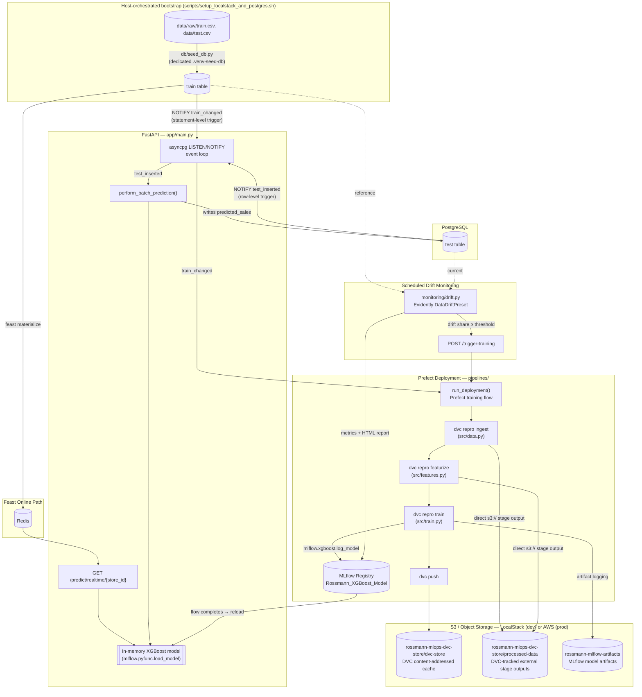

# Rossmann Demand Forecasting — Event-Driven MLOps Platform

<p align="left">
  
  
  
  
  
  
  
  
</p>
<p align="left">
  
  
  
  
  
  
  
  
</p>
<p align="left">
  
  
  
  
</p>

An end-to-end demand forecasting system built around a single idea: **the database is the event bus**. New training data lands in PostgreSQL, a trigger fires, Prefect retrains through DVC, MLflow registers the new model, and the serving API hot-swaps it in memory — no polling, no cron jobs guessing when to check for new data, no manual redeploys.

The whole stack ships two ways from the same source: **Docker Compose** for a fast local loop, and **Terraform-provisioned K3s** for a production-representative Kubernetes deployment — same containers, same database schema, same closed loop, different orchestrator.

## Architecture



**Two deployment targets, one codebase:**

| | Docker Compose | Terraform + K3s |
|---|---|---|
| Use case | Fast local iteration | Production-representative Kubernetes |
| Provisioning | `docker compose up` | `terraform apply` against a real cluster |
| Secrets | `.env` file | Kubernetes `Secret` objects |
| Networking | Published host ports | `kubectl port-forward` tunnels + Traefik ingress with TLS |
| State | Docker named volumes | PersistentVolumeClaims |

Both deployment scripts publish the same host ports, so only one stack runs at a time — the deploy scripts detect and free the other stack's ports automatically (see [Getting Started](#getting-started)).

## Why this is more than a training script

- **Closed-loop retraining with no polling.** A `train` table write fires a Postgres `NOTIFY`; FastAPI's `asyncpg` listener catches it and calls a real Prefect Deployment (`flow.serve()`, no separate worker process) — not a subprocess spawned ad hoc. The training trigger is a *statement-level* trigger (fires once per bulk insert, not once per row); the prediction trigger is *row-level* (never misses a new test record). That distinction is deliberate, not incidental.
- **Postgres-backed everything, not local files.** MLflow's tracking store, Prefect's orchestration database, and Feast's registry all live in dedicated PostgreSQL databases (`mlflow`, `prefect`, `feast`, `rossmann`) inside the same instance, bootstrapped idempotently by `app/db_bootstrap.py`. None of them fall back to SQLite or a local `mlruns/` folder — a common shortcut in demo projects that quietly breaks the moment you run more than one container.
- **Database seeding is a host-orchestrated, one-time bootstrap step — not baked into the API image.** `scripts/setup_localstack_and_postgres.sh` creates a small, dedicated virtual environment (`.venv-seed-db`, pandas/SQLAlchemy/psycopg2 only) and runs `db/seed_db.py` directly against `data/raw/train.csv`/`data/test.csv` *before* the API container ever starts — the API image never copies the raw CSVs and never runs the seed step itself, so there's nothing to duplicate or leave stale in a container volume. Every deploy script runs this step before bringing the API up, closing a real race condition where the API's first boot could otherwise start training against an empty database.
- **S3 is a first-class, independent storage layer, not an incidental DVC detail.** Three distinct buckets/prefixes exist for three different reasons: DVC's own content-addressed cache (`dvc-store`), MLflow's model artifacts (`rossmann-mlflow-artifacts`), and DVC's own pipeline stage outputs (`processed-data`) — `src/data.py` and `src/features.py` write their `dvc.yaml` stage outputs *directly* to `s3://.../processed-data/...` (declared with `cache: false`, since DVC 3.x doesn't support caching external outputs), so `clean_data.parquet` and `train_features.parquet` are always a real, browsable S3 object, not just a local cache entry.
- **Real feature store, both paths.** Feast serves batch features from a PostgreSQL offline source and online features from Redis in under 10ms — not two different in-memory implementations pretending to be one system.
- **Drift monitoring that actually closes the loop.** `monitoring/drift.py` runs Evidently's `DataDriftPreset` against the same feature-engineering path used in training (`src/features.py`, shared, not reimplemented), logs the result as its own MLflow run, and — on a schedule via GitHub Actions — calls `POST /trigger-training` on a deployed instance when drift crosses a threshold. Retraining isn't a button a human has to remember to press.
- **Secrets and TLS are real, not stubbed.** Kubernetes `Secret` objects carry Postgres and S3 credentials (referenced via `secret_key_ref`, never inlined into a Deployment spec), and a self-signed cert generated by Terraform's `tls` provider terminates HTTPS at a Traefik ingress in front of the API, MLflow, and Prefect UIs.
- **The deploy scripts actively arbitrate shared infrastructure, not just services.** Docker Compose and K3s publish the *same* host ports (8000, 5000, 4200, 5432, 6379, 4566). K3s's own ServiceLB binds those ports directly on the host — independent of any `kubectl port-forward` tunnel — so switching stacks means actually stopping the other one, not just killing a tunnel process. Every deploy script does this handoff automatically in both directions before binding its own ports.
- **Dual-mode deployment from one Terraform module.** The same `deploy/terraform/main.tf` that stands up the demo also documents the exact migration path to native AWS services (RDS, ECS, S3) — the LocalStack endpoint is a variable, not a hardcoded assumption.

## Tech stack

| Layer | Technology |
|---|---|
| API | FastAPI, Uvicorn, asyncpg |
| Model | XGBoost |
| Experiment tracking / registry | MLflow (PostgreSQL-backed tracking store, S3-backed artifact store) |
| Orchestration | Prefect 2.x, served via `flow.serve()` |
| Data versioning | DVC, S3 remote with direct `s3://` stage outputs (LocalStack locally, AWS-ready) |
| Feature store | Feast — PostgreSQL offline store, Redis online store, SQL-backed registry |
| Database | PostgreSQL 15 |
| Cache / online store | Redis 7 |
| Object storage | LocalStack S3 (dev) / AWS S3 (prod path) — 3 buckets/prefixes: DVC cache, MLflow artifacts, DVC stage outputs |
| Drift monitoring | Evidently, logged to MLflow, scheduled via GitHub Actions |
| Containers | Docker, custom images for the API, MLflow, and Prefect |
| Local orchestration | Docker Compose |
| Production-representative orchestration | Kubernetes (K3s) via Terraform (`hashicorp/kubernetes`) |
| Ingress / TLS | Traefik + self-signed cert via `hashicorp/tls` |
| CI/CD | GitHub Actions — lint + test on push/PR, scheduled drift check |
| Testing | pytest, 31 unit tests across 7 modules |

## Repository structure

```
.
├── app/
│   ├── main.py              # FastAPI app: event loop, prediction routes, model hot-swap
│   └── db_bootstrap.py      # Idempotently ensures mlflow/prefect/feast/rossmann databases exist
├── src/
│   ├── data.py               # DVC "ingest" stage — loads train table, writes parquet directly to S3
│   ├── features.py           # Shared feature transform — used by training, serving, and drift
│   ├── model.py               # XGBoost model factory
│   ├── train.py                # DVC "train" stage — fits, evaluates, logs to MLflow
│   ├── evaluate.py            # RMSPE metric
│   └── predict_initial.py    # One-shot batch prediction run at container boot
├── db/
│   ├── init.sql                # Schema + NOTIFY triggers (the event backbone)
│   ├── create-databases.sql
│   └── seed_db.py              # Loads the raw Rossmann CSVs into Postgres — run from the host, before the API ever starts
├── pipelines/
│   ├── training_pipeline.py  # Prefect flow: DVC ingest → featurize → train → push
│   └── serve_deployment.py    # Registers the Prefect Deployment the API triggers
├── monitoring/
│   └── drift.py                # Evidently drift check, MLflow-logged, CI-schedulable
├── feature_repo/
│   ├── feature_store.yaml     # Feast: Postgres offline store, Redis online store, SQL registry
│   ├── features.py             # Feast entity/FeatureView definitions
│   └── materialize.py
├── docker/
│   ├── api.Dockerfile           # Never copies data/ or runs the seed step — seeding is host-side only
│   ├── mlflow.Dockerfile       # Adds psycopg2-binary + pinned boto3 to the upstream MLflow image
│   ├── prefect.Dockerfile      # Adds asyncpg to the upstream Prefect image
│   └── entrypoint.sh            # Bootstraps DBs, applies Feast, trains, serves — no seeding here
├── deploy/
│   ├── docker-compose.yaml
│   ├── .env.example
│   └── terraform/
│       └── main.tf              # Full K3s stack: Secrets, PVCs, Deployments, Traefik ingress + TLS
├── scripts/                    # WSL-targeted deploy automation (see Getting Started)
│   ├── deploy_compose_clean_wsl.bat
│   ├── deploy_compose_reconcile_wsl.bat
│   ├── deploy_k3s_clean_wsl.bat
│   ├── deploy_k3s_reconcile_wsl.bat
│   ├── install_terraform.sh
│   └── setup_localstack_and_postgres.sh   # LocalStack buckets + Postgres seeding, run once per deploy before the API starts
├── tests/                       # 31 unit tests — data, features, model, evaluate, db_bootstrap, serve_deployment, training_pipeline
├── .github/workflows/
│   ├── ci.yml                   # flake8 + pytest on push/PR to main
│   └── drift-monitoring.yml     # Scheduled drift check with an isolated Postgres service container
├── dvc.yaml                     # ingest → featurize → train pipeline definition (direct s3:// stage outputs)
└── pytest.ini
```

## Getting started

### Setting up a blank Windows machine (do this once)

Skip straight to [Prerequisites recap](#prerequisites-recap) if WSL2, Docker, and k3s are already set up. Otherwise, here's everything a factory-fresh Windows machine needs before any deploy script will run.

**1. Enable WSL2 and install Ubuntu.** Open PowerShell **as Administrator**:

```powershell
wsl --install -d Ubuntu
```

This turns on the Windows features WSL2 needs (may require one reboot), then downloads and installs Ubuntu. If virtualization is disabled in the BIOS/UEFI — common on machines straight out of the box — enable "Intel VT-x" / "AMD-V" there first; the exact menu name depends on the motherboard. After rebooting, Ubuntu launches once on its own to finish setup and asks for a Linux username/password — remember these, `sudo` will ask for the password later.

**2. Install Docker Engine inside WSL — not Docker Desktop.** The `scripts/*_wsl.bat` files in this repo talk to Docker's engine running directly inside the WSL Ubuntu distro, which is faster than Docker Desktop's separate VM layer. Open the Ubuntu terminal (search "Ubuntu" in the Start menu) and run:

```bash
curl -fsSL https://get.docker.com | sudo sh
sudo usermod -aG docker $USER
```

Close and reopen the Ubuntu terminal for the group membership to take effect, then confirm it worked:

```bash
docker run hello-world
```

**3. Install k3s — only needed for the Kubernetes/Terraform deploy path.** Skip this if Docker Compose is the only path you'll use. Still inside the Ubuntu terminal:

```bash
curl -sfL https://get.k3s.io | sh -
```

This installs k3s as an enabled systemd service, which is what `scripts/deploy_k3s_*.bat` expect. Confirm it's running:

```bash
sudo systemctl status k3s
```

**4. Install git and clone the repository.** Git ships with most recent WSL Ubuntu images, but if it's missing:

```bash
sudo apt update && sudo apt install -y git
```

Then:

```bash
git clone https://github.com/benkeddad/mlops-demand-forecast.git
cd mlops-demand-forecast
```

**5. (Optional) Install the AWS CLI, for the local S3/LocalStack buckets.** `scripts/setup_localstack_and_postgres.sh` uses the `aws` CLI to create the three S3 buckets/prefixes this project uses (DVC's cache, MLflow's artifacts, and DVC's stage outputs). Without it, LocalStack still runs — the buckets just won't exist, and anything that writes to S3 skips itself gracefully instead of failing.

```bash
curl "https://awscli.amazonaws.com/awscli-exe-linux-x86_64.zip" -o "awscliv2.zip"
sudo apt install -y unzip && unzip awscliv2.zip
sudo ./aws/install
```

That's the entire one-time setup. Everything from here on runs from a normal `cmd.exe` or PowerShell prompt at the repository root, on the **Windows** side — not inside the Ubuntu terminal.

### Prerequisites recap

- Windows with **WSL2** and an Ubuntu distro
- **Docker Engine installed inside WSL** (the deploy scripts auto-start the daemon if it isn't running)
- For the Kubernetes path only: **k3s installed as a systemd service** inside the same WSL distro. Terraform itself doesn't need to be installed manually — `scripts/install_terraform.sh` fetches it automatically the first time it's needed.

### Option A — Docker Compose (fastest local loop)

```cmd
copy deploy\.env.example deploy\.env
scripts\deploy_compose_clean_wsl.bat
```

`deploy_compose_clean_wsl.bat` tears down and rebuilds everything from scratch — use it the first time, or any time you want a guaranteed-clean state. For everyday restarts that preserve your data, use the non-destructive variant instead:

```cmd
scripts\deploy_compose_reconcile_wsl.bat
```

Either script checks for — and reliably stops — a running K3s deployment first, since both stacks publish the same host ports; K3s's own ServiceLB binds those ports directly on the host, so the script actually stops the k3s service (not just a port-forward tunnel) before Compose binds anything. First boot takes a few minutes: Postgres and Redis start, the custom MLflow/Prefect images build, LocalStack's buckets are created and Postgres is seeded from `data/raw/train.csv`/`data/test.csv` via a dedicated `.venv-seed-db`, and only then does the API container start — `entrypoint.sh` bootstraps the databases, applies the Feast definitions, runs an initial training pass, and computes the first batch of predictions before the API comes up.

### Option B — Terraform + K3s (production-representative)

```cmd
scripts\deploy_k3s_clean_wsl.bat
```

or, for a non-destructive reconciliation that skips `terraform apply` when nothing is missing and only restarts unhealthy deployments:

```cmd
scripts\deploy_k3s_reconcile_wsl.bat
```

This path resets the WSL VM for a guaranteed-clean storage state, restarts the k3s systemd service, pre-loads base images into containerd, builds and imports the three custom images, and runs Terraform against the live cluster. The Rossmann API deployment is scaled to zero replicas immediately after `terraform apply` and only scaled back up once LocalStack's buckets exist and Postgres has been seeded — this closes a real race condition where the API's very first boot could otherwise start training against an empty database. Credentials here come from Terraform variables (`TF_VAR_postgres_password`, etc., or a gitignored `terraform.tfvars`), not `deploy/.env` — the built-in defaults match `.env.example` so it works with zero flags out of the box.

### Once it's up

| Interface | URL |
|---|---|
| API + Swagger docs | http://localhost:8000/docs |
| MLflow | http://localhost:5000 |
| Prefect | http://localhost:4200 |
| PostgreSQL | localhost:5432 |
| LocalStack (S3) | localhost:4566 |

Each deploy script opens a live log/port-forward console per service, and safely closes any stale ones from a previous run before opening new ones.

## How the closed loop actually works

1. Before the API ever starts, `scripts/setup_localstack_and_postgres.sh` seeds `data/raw/train.csv` and `data/test.csv` into Postgres via `db/seed_db.py`, run in a dedicated `.venv-seed-db` virtual environment — idempotent, so it skips tables that already have data. This is a one-time, host-orchestrated bootstrap step, not something the API image or its entrypoint does.
2. Any change to the `train` table fires `notify_train_change()` — a **statement-level** trigger, so a 900,000-row bulk seed fires it once, not 900,000 times.
3. FastAPI's `asyncpg` listener catches `train_changed` and calls `run_deployment()` against the already-running Prefect Deployment (`pipelines/serve_deployment.py`, started once at API startup via `flow.serve()`) — no subprocess spawned per trigger.
4. The Prefect flow drives DVC through `ingest → featurize → train → push`: `src/data.py` snapshots the table directly to a `s3://.../processed-data/clean_data.parquet` stage output, `src/features.py` builds the exact model-input schema the same way, `src/train.py` fits an `XGBRegressor`, evaluates RMSPE, and registers it to MLflow as `Rossmann_XGBoost_Model`. `dvc push` separately uploads DVC's own content-addressed cache to its `dvc-store` prefix — a different S3 location for a different purpose (reproducibility vs. the pipeline's actual tracked outputs).
5. When the flow run reaches a terminal state, FastAPI reloads the model in-process (`mlflow.pyfunc.load_model`) — the API never restarts.
6. Every `test` row insert fires `notify_test_insert()` — a **row-level** trigger this time, so no new record is missed — which triggers `perform_batch_prediction()` to fill in `predicted_sales` for every row still `NULL`.
7. `/predict/realtime/{store_id}` takes a separate, faster path: it reads pre-materialized features straight from Feast's Redis online store instead of touching Postgres at request time.
8. Independently, `monitoring/drift.py` compares the `train` and `test` populations through Evidently, runs on a schedule via `drift-monitoring.yml`, and — when configured with a `RETRAIN_TRIGGER_URL` repository variable — calls `POST /trigger-training` on a live instance to close the loop without a human in it.

## API reference

| Method | Path | Description |
|---|---|---|
| `GET` | `/` | Redirects to `/docs` |
| `GET` | `/docs` | Interactive Swagger UI |
| `GET` | `/health` | API and model-load status |
| `GET` | `/predict/realtime/{store_id}` | Real-time inference via the Feast/Redis online store |
| `POST` | `/trigger-training` | Manually fires the Prefect training deployment |
| `POST` | `/reload-model` | Reloads the latest registered model from MLflow without retraining |

## Testing & CI

```bash
pytest -v
```

31 unit tests across `tests/`, covering the DVC data split, feature engineering (date decomposition, holiday-code mapping, leakage-column drops, lowercase-column normalization from Postgres), the RMSPE metric, the model factory, database bootstrapping, the Prefect deployment registration, and every stage of the training pipeline (including the LocalStack S3 endpoint wiring DVC subprocesses need). `pytest.ini` sets `pythonpath = . src pipelines` so both repo-root-style imports (used by `app/main.py`, `monitoring/drift.py`) and script-style imports (used when DVC or Prefect run a module directly) resolve identically under test.

- **`ci.yml`** — flake8 (syntax/undefined-name errors only, across `src`, `app`, `pipelines`, and `db`) + the full pytest suite, on every push and PR to `main`.
- **`drift-monitoring.yml`** — runs daily at 06:00 UTC against a disposable Postgres service container seeded from the same schema and CSVs the real stack uses, so it's a genuine drift check rather than a placeholder. On significant drift it fails the job and, if `RETRAIN_TRIGGER_URL` is set, calls a deployed instance's `/trigger-training` endpoint.

## Known limitations

Documented deliberately rather than discovered by a reviewer:

- **`/trigger-training` has no authentication in front of it.** Fine for local/demo use; anything internet-reachable needs an API key, mTLS, or a network policy in front of it first.
- **The K3s ingress TLS cert is self-signed**, generated fresh by Terraform on every `apply`. Good enough for local HTTPS termination through Traefik; swap for a `cert-manager`-issued or CA-signed cert before exposing this beyond a local demo.
- **LocalStack has no persistence.** All three S3 buckets/prefixes are recreated on every deploy (`scripts/setup_localstack_and_postgres.sh` self-heals them, and `docker/entrypoint.sh` self-heals the DVC-relevant ones as a second line of defense); this is fine for demo artifacts, not a substitute for real S3.
- **DVC's `processed-data` stage outputs are declared `cache: false`.** Since DVC 3.x doesn't support caching external (`s3://`) outputs, these are the pipeline's real, authoritative tracked outputs — not a local cache with an S3 mirror bolted on. An S3 outage during `ingest`/`featurize` fails that stage outright, by design.
- **Single-node K3s** — no HA, no autoscaling. It demonstrates real Kubernetes/Terraform provisioning, not production scale.
- **The `scripts/*.bat` files are WSL2/Windows-specific by design** (this is the author's environment). The Compose file and Terraform module underneath them are ordinary and portable; only the automation wrapper is not.
- **Default credentials (`user`/`Password`, `test`/`test` for LocalStack) ship for zero-friction local startup.** Override them via `deploy/.env` (Compose) or `TF_VAR_postgres_password` / `terraform.tfvars` (Terraform) for anything beyond local dev.

## About the author

This project was built end-to-end by **Youcef Benkeddad** ([@benkeddad](https://github.com/benkeddad)) to showcase practical, production-oriented MLOps engineering — not just a notebook that happens to output a model.

Building and hardening it end-to-end involved developing/demonstrating:

- **Event-driven system design** — replacing polling with Postgres `LISTEN`/`NOTIFY`, and correctly choosing statement-level vs. row-level triggers for two genuinely different event semantics.
- **ML lifecycle engineering** — wiring MLflow (tracking + registry), Prefect (orchestration), DVC (data/pipeline versioning), and Feast (offline + online feature serving) into one coherent, Postgres-backed system instead of four disconnected demo tools.
- **Infrastructure as Code** — a single Terraform module provisioning Kubernetes Secrets, PersistentVolumeClaims, Deployments, a Traefik ingress, and a self-signed TLS certificate, with a documented migration path to native AWS services.
- **Dual-runtime deployment engineering** — one codebase shipping identically through Docker Compose and Terraform-provisioned K3s, including correctly arbitrating host-port ownership between two orchestrators that both try to bind the same ports.
- **Root-causing distributed-systems failures, not just symptoms** — diagnosing and fixing a live race condition between database seeding and API startup, and tracing an intermittent connection failure all the way through a Kubernetes ServiceLB hostPort binding to confirm the actual root cause with controlled, repeatable tests rather than guesswork.
- **Security-conscious defaults** — credentials delivered via Kubernetes `Secret` objects and `secret_key_ref`, never inlined into manifests, with real TLS termination in front of every UI.
- **Operational monitoring** — closing the loop with automated, scheduled drift detection that can trigger retraining on its own, with its own audit trail in MLflow.
- **Test-driven infrastructure code** — 31 unit tests covering not just model logic but the orchestration/pipeline code itself, enforced in CI on every push.
